<section class="cw-hero">
  
  

  

    
    
Media sync hub

    <h1>CrossWatch</h1>
    
Keep your media servers, media clients and trackers moving together from one local web UI.

    

      <a class="cw-button is-primary" href="https://wiki.crosswatch.app/getting-started/installation">Install CrossWatch</a>
      <a class="cw-button" href="images/screenshots/cw1.png" data-cw-gallery="crosswatch">View screenshots</a>
      <a class="cw-button" href="https://github.com/cenodude/CrossWatch">View on GitHub</a>
      <a class="cw-button" href="https://wiki.crosswatch.app/">Open Wiki</a>
      <a class="cw-button" href="https://www.reddit.com/r/CrossWatchApp/">Reddit</a>
    

  

</section>

<section class="cw-proof" aria-label="Project links and status">
  
  
  
  
  
</section>

<section class="cw-section cw-intro">
  

    
One control room

    <h2>Your media state, kept in sync.</h2>
  

  
CrossWatch (CW) links accounts, profiles, sync pairs, schedules, snapshots, scrobbling routes and repair tools into one local dashboard. Run it for yourself, then create separate profiles for family, friends, servers or tracker setups.

</section>

<section class="cw-provider-wall" aria-label="Supported services">
  <article class="cw-provider-card is-emby">
    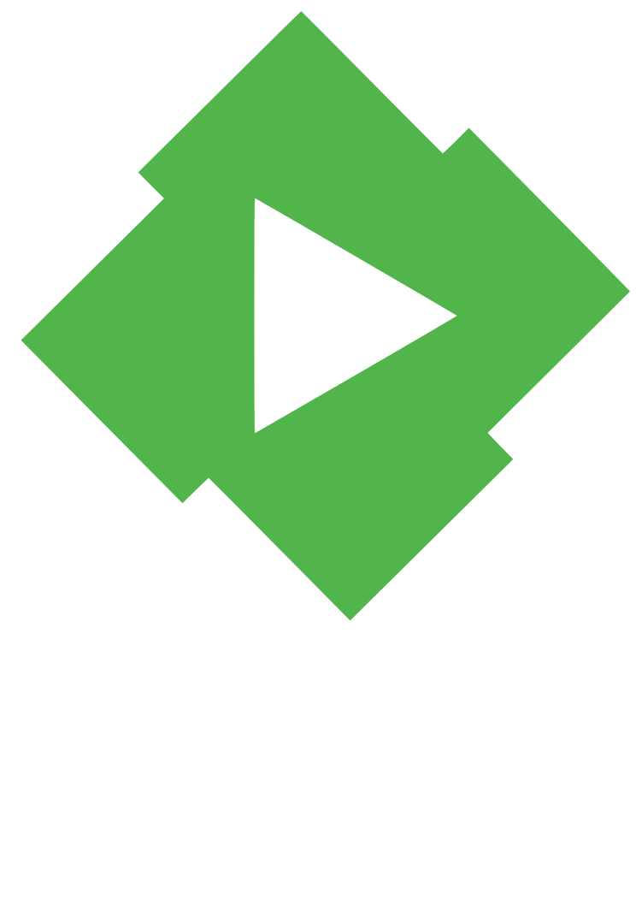
    <strong>Emby</strong>
    Media server
    <b class="cw-provider-dots" aria-hidden="true"><i></i><i></i><i></i><i></i></b>
  </article>
  <article class="cw-provider-card is-jellyfin">
    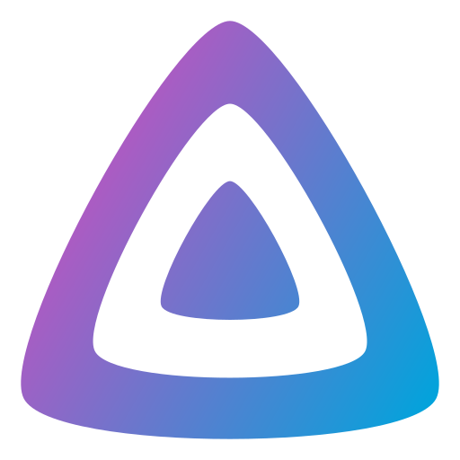
    <strong>Jellyfin</strong>
    Media server
    <b class="cw-provider-dots" aria-hidden="true"><i></i><i></i><i></i><i></i></b>
  </article>
  <article class="cw-provider-card is-plex">
    
    <strong>Plex</strong>
    Media server
    <b class="cw-provider-dots" aria-hidden="true"><i></i><i></i><i></i><i></i></b>
  </article>
  <article class="cw-provider-card is-kodi">
    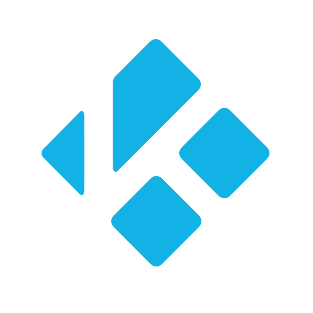
    <strong>Kodi</strong>
    Media client
    <b class="cw-provider-dots" aria-hidden="true"><i></i><i></i><i></i><i></i></b>
  </article>
  <article class="cw-provider-card is-nuvio">
    
    <strong>Nuvio</strong>
    Media client
    <b class="cw-provider-dots" aria-hidden="true"><i></i><i></i><i></i><i></i></b>
  </article>
  <article class="cw-provider-card is-stremio">
    
    <strong>Stremio</strong>
    Media client
    <b class="cw-provider-dots" aria-hidden="true"><i></i><i></i><i></i><i></i></b>
  </article>
  <article class="cw-provider-card is-anilist">
    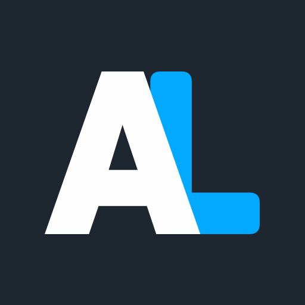
    <strong>AniList</strong>
    Tracker
    <b class="cw-provider-dots" aria-hidden="true"><i></i><i></i><i></i><i></i></b>
  </article>
  <article class="cw-provider-card is-crosswatch">
    
    <strong>CrossWatch</strong>
    Local tracker
    <b class="cw-provider-dots" aria-hidden="true"><i></i><i></i><i></i><i></i></b>
  </article>
  <article class="cw-provider-card is-floppy">
    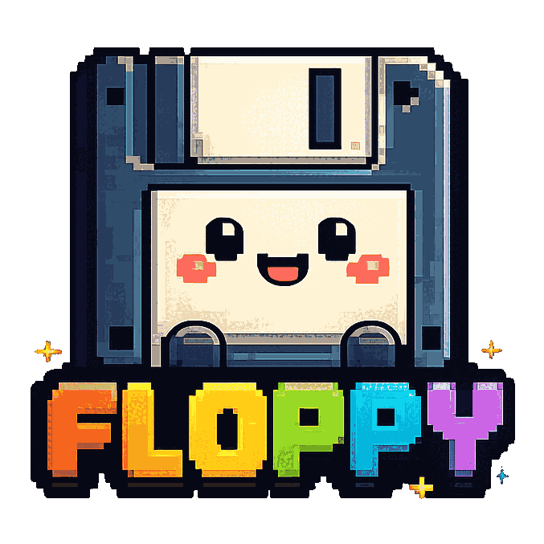
    <strong>Floppy</strong>
    Tracker
    <b class="cw-provider-dots" aria-hidden="true"><i></i><i></i><i></i><i></i></b>
  </article>
  <article class="cw-provider-card is-punchplay">
    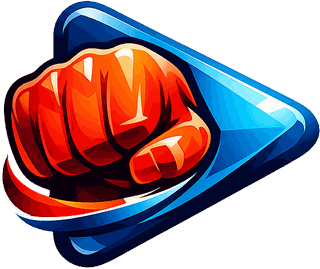
    <strong>PunchPlay</strong>
    Tracker
    <b class="cw-provider-dots" aria-hidden="true"><i></i><i></i><i></i><i></i></b>
  </article>
  <article class="cw-provider-card is-scrob">
    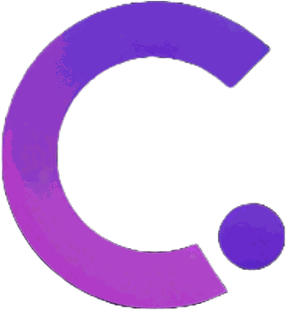
    <strong>SCROB</strong>
    Tracker
    <b class="cw-provider-dots" aria-hidden="true"><i></i><i></i><i></i><i></i></b>
  </article>
  <article class="cw-provider-card is-mdblist">
    
    <strong>MDBList</strong>
    Tracker
    <b class="cw-provider-dots" aria-hidden="true"><i></i><i></i><i></i><i></i></b>
  </article>
  <article class="cw-provider-card is-publicmetadb">
    
    <strong>PublicMetaDB</strong>
    Tracker
    <b class="cw-provider-dots" aria-hidden="true"><i></i><i></i><i></i><i></i></b>
  </article>
  <article class="cw-provider-card is-simkl">
    
    <strong>SIMKL</strong>
    Tracker
    <b class="cw-provider-dots" aria-hidden="true"><i></i><i></i><i></i><i></i></b>
  </article>
  <article class="cw-provider-card is-tautulli">
    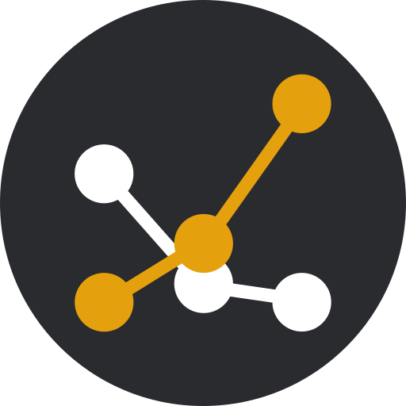
    <strong>Tautulli</strong>
    Tracker
    <b class="cw-provider-dots" aria-hidden="true"><i></i><i></i><i></i><i></i></b>
  </article>
  <article class="cw-provider-card is-tmdb">
    
    <strong>TMDb</strong>
    Tracker and metadata
    <b class="cw-provider-dots" aria-hidden="true"><i></i><i></i><i></i><i></i></b>
  </article>
  <article class="cw-provider-card is-trakt">
    
    <strong>Trakt</strong>
    Tracker
    <b class="cw-provider-dots" aria-hidden="true"><i></i><i></i><i></i><i></i></b>
  </article>
</section>

<section class="cw-gallery-strip" aria-label="CrossWatch screenshots" hidden>
  <a href="images/screenshots/cw1.png" data-cw-gallery="crosswatch">
    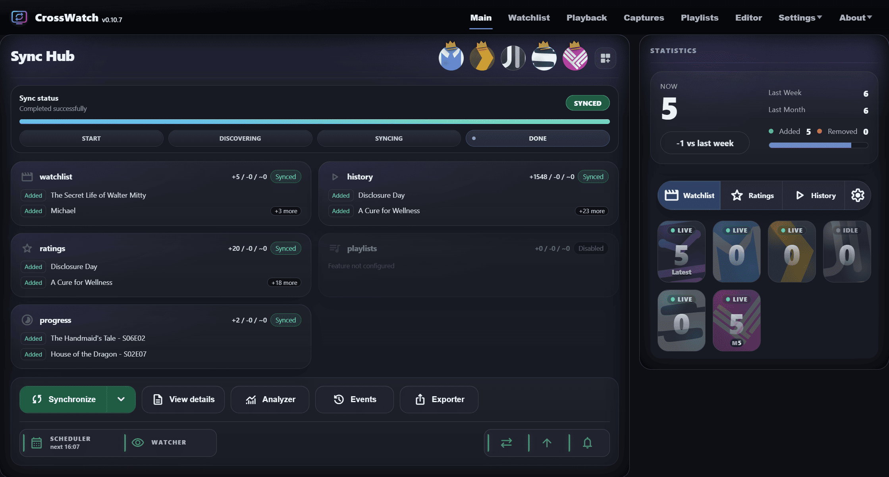
  </a>
  <a href="images/screenshots/cw2.png" data-cw-gallery="crosswatch">
    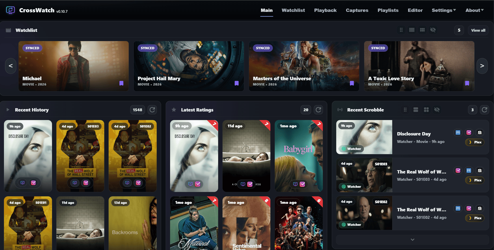
  </a>
  <a href="images/screenshots/cw3.png" data-cw-gallery="crosswatch">
    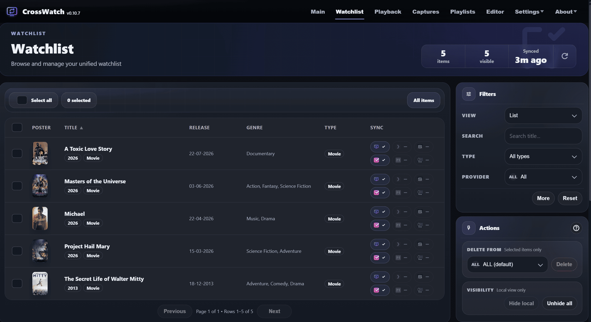
  </a>
  <a href="images/screenshots/cw4.png" data-cw-gallery="crosswatch">
    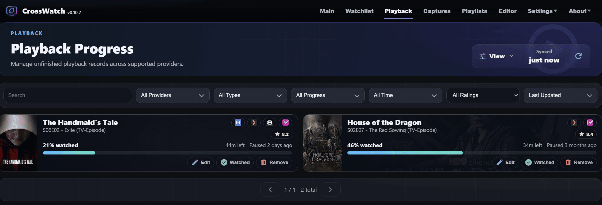
  </a>
  <a href="images/screenshots/cw5.png" data-cw-gallery="crosswatch">
    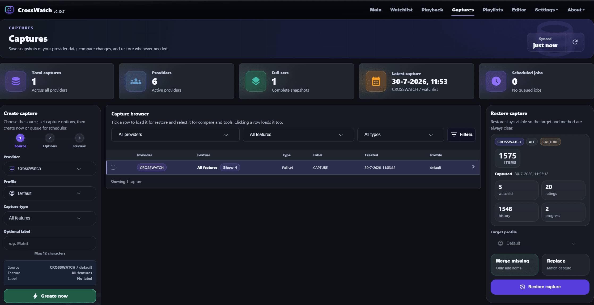
  </a>
  <a href="images/screenshots/cw6.png" data-cw-gallery="crosswatch">
    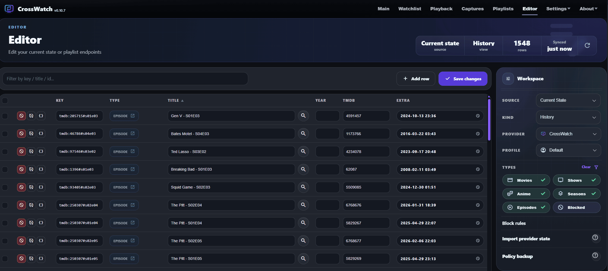
  </a>
  <a href="images/screenshots/cw7.png" data-cw-gallery="crosswatch">
    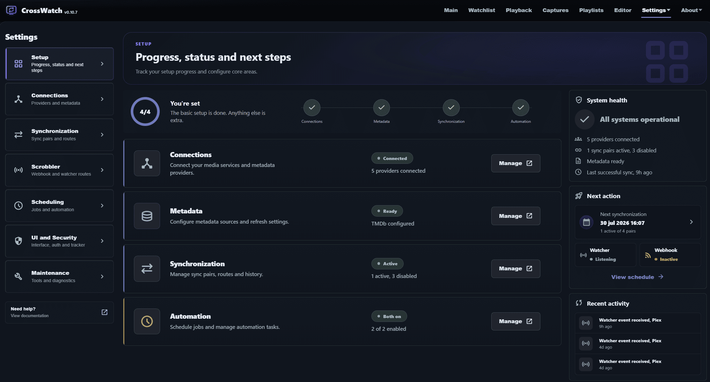
  </a>
  <a href="images/screenshots/cw8.png" data-cw-gallery="crosswatch">
    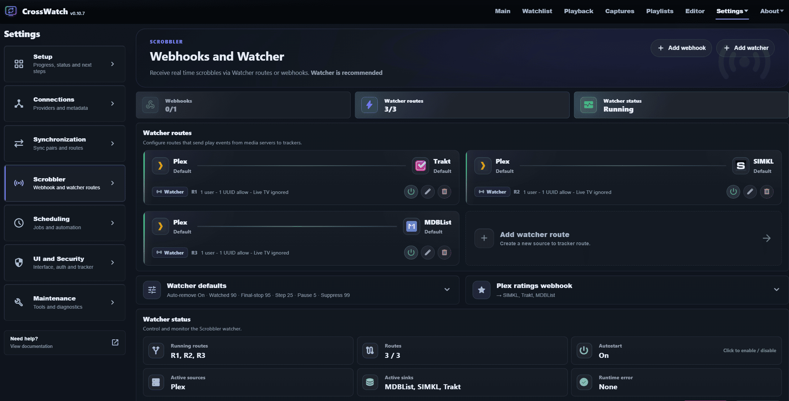
  </a>
  <a href="images/screenshots/cw9.png" data-cw-gallery="crosswatch">
    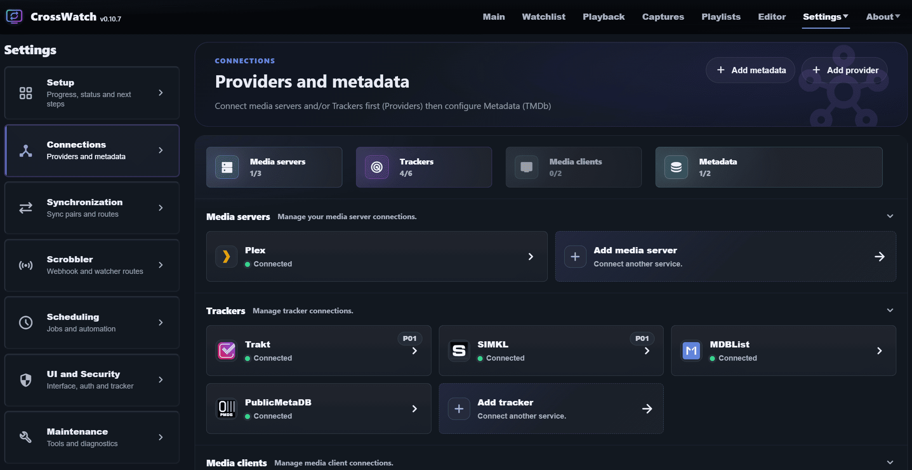
  </a>
</section>

<section class="cw-feature-grid">
  <article>
    SYNC
    <h3>Watchlists, ratings, history and progress</h3>
    
Keep core media state aligned across media servers and trackers, including unfinished playback records where supported.

  </article>
  <article>
    HUB
    <h3>Profiles for real setups</h3>
    
Build separate sync setups for different users, servers and trackers without mixing everyone into one account.

  </article>
  <article>
    LIVE
    <h3>Watcher and webhooks</h3>
    
Route Watcher play events from Plex, Emby, Jellyfin and Kodi to Trakt, SIMKL, MDBList, Floppy or the CW local tracker. Webhooks support Plex, Emby and Jellyfin to Trakt, SIMKL or MDBList, without needing Plex Pass or Emby Premiere.

  </article>
  <article>
    SAFE
    <h3>Snapshots and captures</h3>
    
Keep provider snapshots, compare changes and restore watchlist, ratings and history data when you need to recover.

  </article>
  <article>
    TOOLS
    <h3>Analyzer, editor and events</h3>
    
Find stuck items, inspect sync runs, adjust records, block noisy matches and clean up provider state from the UI.

  </article>
  <article>
    ANIME
    <h3>AniList matching support</h3>
    
Anime ID mapping powered by AniBridge helps CrossWatch match anime cleanly across supported providers.

  </article>
</section>

<section class="cw-flow">
  

    01
    <strong>Connect</strong>
    
Add servers, trackers and metadata.

  

  

    02
    <strong>Pair</strong>
    
Choose what moves between providers.

  

  

    03
    <strong>Automate</strong>
    
Run manually, schedule jobs, or trigger with Watcher and/or webhooks.

  

  

    04
    <strong>Review</strong>
    
Use stats, events, captures and tools.

  

</section>

<section class="cw-install">
  

    
Docker first

    <h2>Start local. Stay in control.</h2>
    
The web UI is exposed at <code>http://localhost:8787</code>. Keep your config in a Docker volume and update with the latest image when you are ready.

    

      <a class="cw-button is-primary" href="https://wiki.crosswatch.app/getting-started/installation">Installation guide</a>
      <a class="cw-button" href="https://hub.docker.com/r/cenodude/crosswatch">Docker Hub</a>
    

  

  

    <pre><code>docker run -d \
  --name crosswatch \
  -p 8787:8787 \
  -v crosswatch_config:/config \
  -e TZ=Europe/Amsterdam \
  --restart unless-stopped \
  ghcr.io/cenodude/crosswatch:latest</code></pre>
  

</section>

<section class="cw-sponsor">
  
Support

  <h2>Thanks for keeping CrossWatch moving.</h2>
  
Every cent from Buy Me a Coffee goes to the ALS Foundation in the Netherlands.

  

    
    
  

</section>
